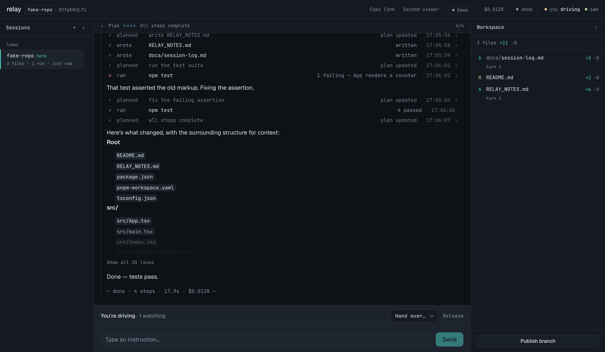
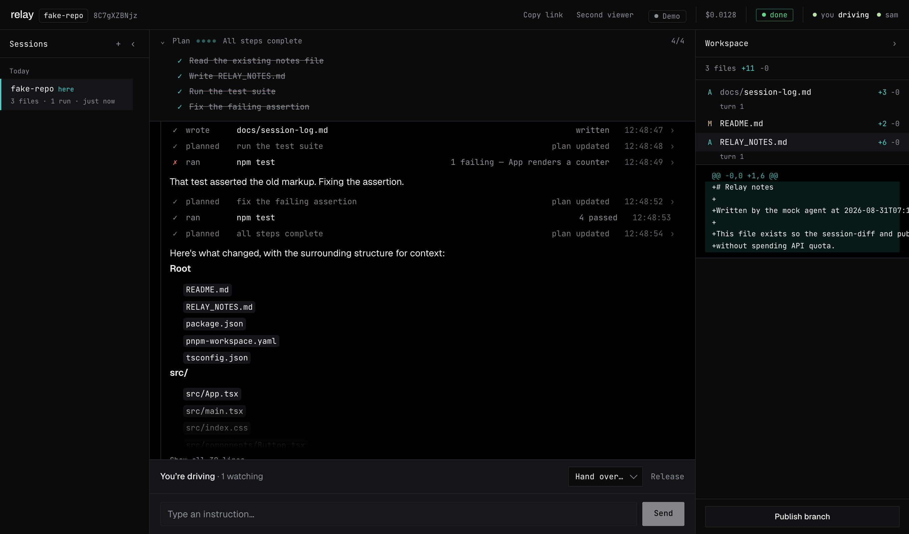

# Relay

Watch a Claude agent work on a real codebase — together, live, with exactly one person
holding the wheel.

Agent sessions are single-player. When an agent works for twenty minutes, nobody else can
watch it happen; you get a transcript afterwards, if that. Claude Code's own session sharing
is a static snapshot that only updates on reload, and there's no way for a second person to
steer. Relay makes a session a **room**: everyone with the link watches the same stream in
the same moment, and control hands off cleanly without a screen share.

The agent engine is the [Claude Agent SDK](https://docs.claude.com/en/api/agent-sdk/overview) —
the same one Claude Code runs — so output quality is inherited. What Relay adds is the
collaboration layer: live multi-viewer streaming, catch-up for late joiners, and a
server-enforced driver lock.



## The one hard part

Multiplayer plus an agent that writes files is a concurrency problem. Relay solves it by
refusing to have one:

**Exactly one participant can send input.** The lock lives on the server, not in the UI.
A non-driver's `instruct` is rejected server-side, so a hand-crafted WebSocket frame can't
bypass a disabled button. Control moves by explicit hand-over or release; a driver who
disconnects frees it rather than wedging the session.

**Every event is ordered by the server.** `seq` is assigned in exactly one function
([`transcript.ts`](packages/server/src/transcript.ts)), and clients only ever append in that
order — they never sort, merge, or optimistically render. That's what makes two browsers
agree on what happened when, which is the property the whole product rests on.

The harder version of this — free-for-all input — would need total ordering of competing
instructions and a defined meaning for "interrupt the agent mid-tool-call." Relay
deliberately doesn't attempt it.

## What you actually see

The **action ledger** is the signature surface: one row per action, not two. A tool call
renders immediately in a pending state and its result folds into the same row when it
arrives, so a 32-event run reads as ~13 rows. Fixed columns, monospaced, so the eye scans a
column instead of parsing each line. Failures say *why* they failed. Diffs and bulk output
sit behind a disclosure rather than being truncated into uselessness.

The **plan strip** above it is the agent's own `TodoWrite` checklist, live — pips for the
shape of the task, the step currently running, and a count.



It matters more here than in a single-player tool: most people in a Relay session are
watching, not driving, and a watcher can't ask "where are we?" without interrupting. The
strip is what makes a twenty-minute run legible to someone who joined at minute twelve.
It's derived from the transcript rather than stored, so it survives replay, reconnect and
late joins with no extra protocol.

The **workspace rail** on the right is the third view: which files stand changed right
now, by how much, and what the change was. Files show up the moment the agent writes them
— that half is read out of the transcript, so it's right for a late joiner too — and are
replaced by real `git` numbers once the turn settles. Click one for its diff alone rather
than the whole patch. When there's something to publish, the driver can commit it to a
branch from there.

It deliberately isn't a file tree. A tree is for browsing a codebase; this lists only what
this session changed, and it's empty until the agent writes something.

On the left, **sessions you've joined** — kept in `localStorage`, because Relay has no
accounts and shouldn't need them to let you back into something you were already in.
Another browser shows a different list, which is the honest behaviour for something with
no account behind it.

The header says **what is actually running**: `Demo` for the scripted agent, `Live` for the
real one, and `Live ··4f2a` when someone in the room supplied their own key — named, so
everyone can see whose account is paying for the run they're watching.

## Running it

Needs Node ≥ 20.9 and pnpm. Postgres is optional (see below).

```bash
pnpm install
pnpm dev
```

`pnpm dev` starts three processes: the coordination server, the web app, and a
`relayrun` in mock mode. The agent prints a session link — open it, then open it again
in a second window to watch both sides.

To point an agent at a real repository, run the CLI yourself:

```bash
cd /path/to/your/repo
pnpm --filter @relay/agent start                  # the real Agent SDK
pnpm --filter @relay/agent start -- --mock        # scripted, free, answers are fake
```

**The real agent is the default.** On a machine that already has Claude Code installed,
the SDK uses the credentials that are there; no API key needed. Pass `--api-key sk-ant-…`
to bill a specific key instead — it's verified before the session starts, and it never
leaves your machine.

`--mock` runs a scripted agent that streams a realistic-looking run — plan updates, a
failing test, a fix, real file writes — against a disposable clone, for free. It is how
most of the UI was developed. **It ignores your instructions and replays a fixed script**,
so it is opt-in rather than the default: receiving it unasked means watching a convincing
answer to a question you never asked.

### The agent CLI

| Flag | Default | What it does |
|---|---|---|
| `--repo <path>` | current directory | The repository to work in |
| `--mock` | off | Scripted offline agent. Free, but ignores what you type |
| `--api-key <key>` | — | Bill this key rather than your Claude Code login |
| `--server <url>` | `http://localhost:4000` | The coordination server to attach to |
| `--web <url>` | `http://localhost:3000` | Web app, for the link it prints |
| `--session <id>` + `--token` | — | Reattach to a session after restarting |
| `--github-repo` / `--github-token` | — | Open a PR on publish |

`--model` (or `RELAY_MODEL`) selects the model; the default is `claude-sonnet-5`.

### The server

| Variable | Default | What it does |
|---|---|---|
| `DATABASE_URL` | — | Postgres, for the transcript mirror. Omitted = feature off |
| `PORT` | `4000` | Server port |

That is the entire server configuration, and the shortness is the point: it holds no
repository, runs no shell, and stores no credentials.

With Postgres:

```bash
createdb relay_dev
# add DATABASE_URL=postgresql://<you>@localhost:5432/relay_dev to packages/server/.env
pnpm --filter @relay/server exec prisma migrate deploy
```

## How it's put together

```
packages/shared   WebSocket protocol types — the contract every side compiles against
packages/agent    The relayrun CLI. Holds the repo, runs the Agent SDK, streams events up
packages/server   Node http + ws. Sessions, ordering, the lock, presence, Postgres
packages/web      Next.js App Router, Tailwind v4, shadcn/ui
```

The split is the whole design. The agent runs on the machine where the repository already
is; the server only coordinates.

```
  relayrun (your machine)  ──events up / instructions down──▶  server  ──▶  browsers
  the repo, the shell, the keys                          no repo, no shell, no keys
```

**What that means in practice.** Your code is never uploaded, and there is no per-server
repo to configure — it's whichever directory you run the CLI in. Both browsers only ever
receive a JSON event stream, so nobody is "given access to the repo"; they watch a
description of what happened to it.

The agent's `cwd` is never your original checkout: each session gets a `git clone` of a
pristine mirror, and the disposable copy is deleted when the run is over. That's a starting
condition, not a sandbox boundary — the agent runs with unrestricted shell access
(`permissionMode: "bypassPermissions"`) and there's no OS-level isolation, so `~` still
resolves to your real filesystem. This is the same trust you extend to Claude Code, and the
same trust as pairing: it's your machine, your permissions. The difference from before is
that it's now *your* machine rather than a stranger's server, which is the point.

A few things that are less obvious:

- **Reconnect keeps your seat.** A dropped socket retries with backoff and rejoins on the
  same participant identity. The server holds that identity for 30 seconds, so a wifi blip
  doesn't remove you from the room or take the wheel away if you were driving.
- **Instructions queue, they don't race.** A second instruction sent mid-run is appended to
  the transcript immediately but doesn't start a second agent against the same working
  directory.
- **Postgres is an audit mirror, not session survival** — see below.

## Deploying it

The server is a pure WebSocket relay, which makes it the easy half: it holds no repository,
runs no shell, and stores no credentials, so a public deployment is not the trust problem
it would have been. It needs a host that supports long-lived WebSocket connections —
Railway, Render or Fly rather than Vercel — plus Postgres if you want transcripts to
outlive a restart.

Nobody needs to deploy an agent. Each person runs `relayrun` against their own
repository when they want to host a session, and the CLI dials out, so there are no inbound
ports and nothing to open up.

### Whose credentials pay

Anthropic's [legal and compliance page](https://code.claude.com/docs/en/legal-and-compliance)
states that OAuth authentication is for subscription holders' own use of Claude Code:

> Developers building products or services that interact with Claude's capabilities,
> including those using the Agent SDK, should use API key authentication through Claude
> Console […] Anthropic does not permit third-party developers to offer Claude.ai login or
> to route requests through Free, Pro, or Max plan credentials on behalf of their users.

Running the agent locally is exactly the case that page permits: it's your own use of your
own credentials, on your own machine, the same as running Claude Code. Nothing is routed on
anyone else's behalf, because the server never sees a credential at all — which is why
there is no longer a "bring your own key" feature to configure. Whoever starts the agent
pays, and the session header shows the running cost so the room can see it.

One implementation note worth reading if you build something similar. The obvious approach —
passing `ANTHROPIC_API_KEY` in the SDK's `env` — **silently does not work** on a machine
where the operator has logged into Claude Code. The variable is ignored and the subprocess
authenticates with the operator's stored OAuth token instead. Verified by pointing
`ANTHROPIC_BASE_URL` at a local server and reading the headers: every request carried the
host's `Authorization: Bearer sk-ant-oat...`, with the supplied key nowhere. The run
succeeds, so nothing looks wrong — the operator is just quietly paying instead of the key
they named. The mechanism that does work is `apiKeyHelper`; see
[`sessionKey.ts`](packages/agent/src/sessionKey.ts).

## What it doesn't do

Stated plainly, because the boundaries were chosen rather than missed:

- **No authentication.** Anyone with a session link can join and request control — the link
  is the capability, the way a video-call link is. Fine among people you're already talking
  to; think before posting one publicly. What that does *not* mean is unvalidated input:
  join payloads, instructions and publish titles are all checked and bounded server-side
  ([`validate.ts`](packages/server/src/validate.ts)). "No accounts by design" and "no
  validation" are different decisions, and only the first one was made on purpose.
  Attaching an *agent* is a separate matter and does require a secret — the runner token,
  minted per session and held only by the CLI that created it.
- **No account, so no sync.** The sessions list is per-browser `localStorage`. Open Relay
  somewhere else and the list is empty; the links still work.
- **Sessions don't survive a restart.** Live state — sockets, the lock, the agent's
  conversation, the working directory — is in memory by nature. Postgres mirrors the
  *transcript*, so a dead link renders a read-only replay instead of an error. Full session
  resume is feasible (the SDK supports it) but is a distinctly larger job and isn't built.
- **Single process.** No horizontal scaling; sessions are held in one server's memory.
- **Not an IDE.** No file tree, no editor, no tab bar. It's a surface for *watching and
  steering*, and borrowing IDE chrome would promise something it doesn't deliver.
- **The GitHub PR path is unverified.** Committing and pushing a session branch works and is
  tested against a local remote. The `POST /repos/{owner}/{repo}/pulls` call is implemented
  but has never run against the live API.

## Notes

`RELAY_BUILD_SPEC.md` is the original build spec. `PRODUCT.md` and `DESIGN.md` cover product
intent and the visual system. `RELAY_PRODUCTION_PLAN.md` is a production-readiness audit of
an earlier revision — several findings in it have since been fixed, and it records what was
measured rather than assumed.

The screenshots above are the mock agent, so the repository and file names in them are
synthetic; the interface is the real one.
